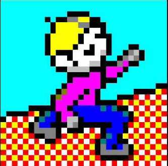
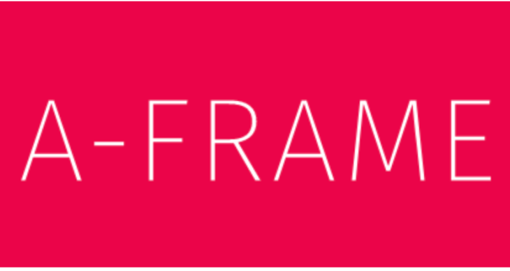

 

  

<h1 align="center">Chip's Challenge - Ep. 1</h1>

  First level of classic Chip's Challenge in VR</a>.
   
  <a href="https://sam-parsons-chips-challenge.glitch.me/"><strong>Live Demo »</strong></a>

 
 

  
   
      

Through the eyes of Chip McCallahan, solve a simple puzzle by collecting all the chips!

## License

I do not own the rights to any actual Chip's Challenge content. This is a creative experiement.
